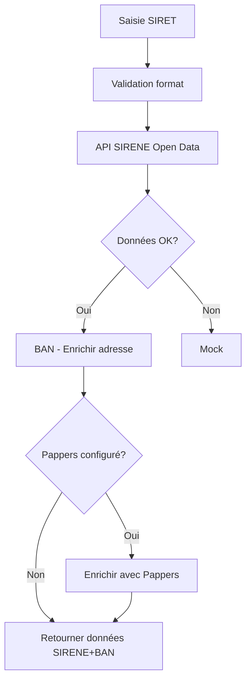

# APIs Open-Source B2B - Documentation complète

Architecture modulaire avec **priorité aux APIs gratuites**, enrichissement optionnel avec Pappers.

## 🎯 Architecture (ordre de priorité)

```
┌────────────────────────────────────────────────────────────────┐
│ 1️⃣ API SIRENE (INSEE) - Open Data PRIORITAIRE                 │
│    ✅ Gratuite, sans authentification                          │
│    📦 Données: SIRET, raison sociale, NAF, forme juridique    │
└────────────────────────────────────────────────────────────────┘
                            ↓
┌────────────────────────────────────────────────────────────────┐
│ 2️⃣ Base Adresse Nationale (BAN) - Open Data OPTIONNEL        │
│    ✅ Gratuite, sans authentification                          │
│    📦 Normalisation et validation d'adresses                   │
└────────────────────────────────────────────────────────────────┘
                            ↓
┌────────────────────────────────────────────────────────────────┐
│ 3️⃣ Pappers - Enrichissement OPTIONNEL                         │
│    💰 Payant (clé API requise)                                 │
│    📦 Capital social, CA, dirigeants, bilans                   │
└────────────────────────────────────────────────────────────────┘
                            ↓
┌────────────────────────────────────────────────────────────────┐
│ 4️⃣ Mock - Développement FALLBACK                              │
│    ✅ Gratuit, données de test                                 │
└────────────────────────────────────────────────────────────────┘
```

---

## 📚 API 1 : SIRENE (INSEE) - Open Data

### Informations générales
- **URL** : https://api.insee.fr/catalogue/
- **Coût** : Gratuit
- **Authentification** : Aucune
- **Rate limit** : 30 requêtes/minute
- **Documentation** : https://api.insee.fr/catalogue/

### Données disponibles
- ✅ SIREN (9 chiffres)
- ✅ SIRET (14 chiffres)
- ✅ Dénomination (raison sociale)
- ✅ Forme juridique
- ✅ Code NAF (activité)
- ✅ Adresse du siège
- ✅ Code postal / Commune
- ✅ Date de création
- ✅ Tranche d'effectif

### Endpoint
```bash
GET https://api.insee.fr/entreprises/sirene/V3/siret/{siret}
```

### Exemple de requête
```typescript
const response = await fetch(
  'https://api.insee.fr/entreprises/sirene/V3/siret/85331999200014',
  {
    headers: {
      'Accept': 'application/json'
    }
  }
);

const data = await response.json();
console.log(data.etablissement.uniteLegale.denominationUniteLegale);
// "TORP FRANCE"
```

### Exemple de réponse
```json
{
  "etablissement": {
    "siret": "85331999200014",
    "uniteLegale": {
      "siren": "853319992",
      "denominationUniteLegale": "TORP FRANCE",
      "categorieJuridiqueUniteLegale": "5710",
      "dateCreationUniteLegale": "2019-05-15"
    },
    "adresseEtablissement": {
      "numeroVoieEtablissement": "123",
      "typeVoieEtablissement": "RUE",
      "libelleVoieEtablissement": "DE LA PAIX",
      "codePostalEtablissement": "75001",
      "libelleCommuneEtablissement": "PARIS"
    },
    "activitePrincipaleEtablissement": "62.01Z",
    "trancheEffectifsEtablissement": "01"
  }
}
```

### Test manuel
```bash
curl "https://api.insee.fr/entreprises/sirene/V3/siret/85331999200014" \
  -H "Accept: application/json"
```

### Fichier
- `src/services/api/external/sirene.service.ts`
- Fonction : `getSireneData(siret: string)`

---

## 📚 API 2 : Base Adresse Nationale (BAN)

### Informations générales
- **URL** : https://adresse.data.gouv.fr
- **Coût** : Gratuit
- **Authentification** : Aucune
- **Rate limit** : Aucune
- **Documentation** : https://adresse.data.gouv.fr/api-doc/adresse

### Utilité
- Normaliser les adresses incomplètes
- Obtenir les coordonnées GPS
- Valider et enrichir les adresses

### Endpoint
```bash
GET https://api-adresse.data.gouv.fr/search/?q={adresse}
```

### Exemple de requête
```typescript
const response = await fetch(
  'https://api-adresse.data.gouv.fr/search/?q=123%20rue%20de%20la%20paix%20paris&limit=5'
);

const data = await response.json();
console.log(data.features[0].properties.label);
// "123 Rue de la Paix 75001 Paris"
```

### Exemple de réponse
```json
{
  "features": [
    {
      "properties": {
        "label": "123 Rue de la Paix 75001 Paris",
        "score": 0.98,
        "housenumber": "123",
        "street": "Rue de la Paix",
        "postcode": "75001",
        "city": "Paris",
        "citycode": "75101"
      },
      "geometry": {
        "coordinates": [2.3319, 48.8697]
      }
    }
  ]
}
```

### Test manuel
```bash
curl "https://api-adresse.data.gouv.fr/search/?q=123%20rue%20de%20la%20paix%20paris"
```

### Fichier
- `src/services/api/external/ban.service.ts`
- Fonction : `searchAddress(query: string)`
- Fonction : `enrichAddress(street, city, postcode)`

---

## 📚 API 3 : Pappers (Enrichissement optionnel)

### Informations générales
- **URL** : https://www.pappers.fr/api
- **Coût** : Payant (abonnement requis)
- **Authentification** : Clé API
- **Documentation** : https://www.pappers.fr/api/documentation

### Données enrichies (non disponibles dans SIRENE)
- ✅ Capital social
- ✅ Chiffre d'affaires (derniers bilans)
- ✅ Résultat net
- ✅ Liste des dirigeants
- ✅ Bénéficiaires effectifs
- ✅ Historique des modifications

### Endpoint
```bash
GET https://api.pappers.fr/v2/entreprise?siret={siret}&api_token={token}
```

### Configuration
```env
VITE_PAPPERS_API_KEY=votre_cle_pappers
```

### Exemple de requête
```typescript
const API_KEY = import.meta.env.VITE_PAPPERS_API_KEY;

const response = await fetch(
  `https://api.pappers.fr/v2/entreprise?siret=85331999200014&api_token=${API_KEY}`
);

const data = await response.json();
console.log(data.capital_social); // 10000
```

### Fichier
- `src/services/api/external/pappers.service.ts`
- Fonction : `getPappersData(siret: string)`
- Fonction : `enrichWithPappers(sireneData)`

---

## 🧪 Tests unitaires

### Test SIRENE seul
```typescript
import { getSireneData } from '@/services/api/external/sirene.service';

const data = await getSireneData('85331999200014');
console.log(data);
// { siren: "853319992", denomination: "TORP FRANCE", ... }
```

### Test BAN seul
```typescript
import { searchAddress } from '@/services/api/external/ban.service';

const results = await searchAddress('123 rue de la paix paris');
console.log(results[0].label);
// "123 Rue de la Paix 75001 Paris"
```

### Test Pappers seul
```typescript
import { getPappersData } from '@/services/api/external/pappers.service';

const data = await getPappersData('85331999200014');
console.log(data.capital_social); // 10000
```

### Test complet (workflow)
```typescript
import { verifySiret } from '@/services/api/pro/companyService';

const result = await verifySiret('85331999200014');
console.log(result);
// {
//   valid: true,
//   data: {
//     siren: "853319992",
//     siret: "85331999200014",
//     raison_sociale: "TORP FRANCE",
//     adresse: "123 Rue de la Paix",
//     code_postal: "75001",
//     ville: "Paris",
//     capital_social: 10000 // Si Pappers configuré
//   }
// }
```

---

## ⚙️ Configuration Vercel

### Variables d'environnement (optionnelles)

```env
# Pappers (enrichissement optionnel)
VITE_PAPPERS_API_KEY=votre_cle_pappers

# Aucune configuration requise pour SIRENE et BAN (100% gratuit)
```

### Dashboard Vercel
1. Aller dans **Settings → Environment Variables**
2. Ajouter uniquement si vous avez un abonnement Pappers :
   - Key: `VITE_PAPPERS_API_KEY`
   - Value: Votre clé API Pappers

---

## 📊 Comparaison des sources

| Donnée | SIRENE | BAN | Pappers | Mock |
|--------|--------|-----|---------|------|
| SIRET | ✅ | ❌ | ✅ | ✅ |
| Raison sociale | ✅ | ❌ | ✅ | ✅ |
| Forme juridique | ✅ | ❌ | ✅ | ✅ |
| Code NAF | ✅ | ❌ | ✅ | ✅ |
| Adresse | ⚠️ | ✅ | ✅ | ✅ |
| Code postal | ✅ | ✅ | ✅ | ✅ |
| Ville | ✅ | ✅ | ✅ | ✅ |
| Date création | ✅ | ❌ | ✅ | ✅ |
| Effectif | ⚠️ (tranche) | ❌ | ✅ (précis) | ✅ |
| Capital social | ❌ | ❌ | ✅ | ❌ |
| Chiffre affaires | ❌ | ❌ | ✅ | ❌ |
| Dirigeants | ❌ | ❌ | ✅ | ❌ |

**Légende** :
- ✅ Disponible
- ⚠️ Partiel
- ❌ Non disponible

---

## 🚀 Workflow complet



---

## 💡 Avantages de cette architecture

1. **100% gratuit par défaut** (SIRENE + BAN)
2. **Modulaire** : chaque API testable indépendamment
3. **Résiliente** : fallback automatique
4. **Évolutive** : facile d'ajouter d'autres sources (API Geo, etc.)
5. **Pappers optionnel** : uniquement si besoin de données enrichies

---

## 📝 Checklist d'implémentation

- [x] Service SIRENE (`sirene.service.ts`)
- [x] Service BAN (`ban.service.ts`)
- [x] Service Pappers (`pappers.service.ts`)
- [x] Intégration dans `companyService.ts`
- [x] Logs de debug pour chaque étape
- [ ] Tests unitaires pour chaque service
- [ ] Documentation UI : afficher source des données
- [ ] Monitoring : tracker le taux d'utilisation de chaque API
